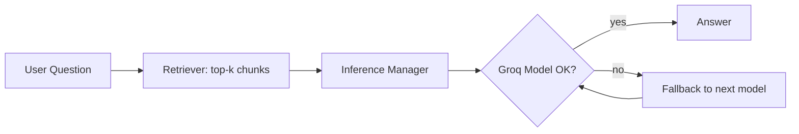

# ⚡ AI-Scrape: Multi-Model AI Engine for Smart Web & Document Scraping


**AI-Scrape** is a monorepo with a **web frontend** and an **API backend**.  
It currently uses **Groq multi‑model inference** with **automatic fallback** to scrape/ingest content, embed it, and answer questions over the ingested data.

---

## 🧭 Repository Layout

```
AI-SCRAPE/
└── apps/
    ├── api/                        # FastAPI backend (Groq + HF integration)
    │   ├── .env                    # API config variables
    │   ├── chunking.py             # splits long text into manageable chunks
    │   ├── doc_store.py            # manages document storage/retrieval
    │   ├── groq_router.py          # routes for Groq model inference
    │   ├── ingest_utils.py         # ingestion, cleaning & preprocessing
    │   ├── llm_groq.py             # Groq model handler + fallback logic
    │   ├── llm_hf.py               # optional HuggingFace model support
    │   ├── main.py                 # FastAPI app entry point
    │   ├── retrieval.py            # embedding-based retrieval logic
    │   ├── summarize_utils.py      # summarization and Q&A utilities
    │   └── temp.py                 # sandbox/testing module
    │
    └── web/                        # Next.js frontend (TypeScript)
        ├── app/
        │   ├── globals.css
        │   ├── layout.tsx
        │   └── page.tsx
        ├── public/
        ├── .env.local
        ├── eslint.config.mjs
        ├── next.config.ts
        ├── next-env.d.ts
        ├── package-lock.json
        └── package.json

```

---

## 🚀 Features

- 🧠 **Multi‑Model Groq Fallback**
  - Rotate across models (e.g., `llama3`, `gemma`, `mixtral`) on token/rate limits and model errors.
- 🕸️ **Web & Document Ingestion**
  - Scrape URLs and parse PDFs/HTML/TXT into clean chunks.
- 🧭 **Embedding + Retrieval**
  - Create vectors and answer questions over your scraped corpus.
- ⚙️ **Clean API**
  - FastAPI routes: `/ingest`, `/query`, `/health`.
- 🧩 **Frontend UI**
  - Upload/URL ingest, dataset browser, and Ask interface that talks to the API.

---

## 🗒️ Environment Variables

### `apps/api/.env`
```
# AI Runtime
GROQ_API_KEY=your_groq_key

# (Optional) Secondary provider
OPENAI_API_KEY=your_openai_key

# Orchestration
MODEL_PRIORITY=llama3,mixtral,gemma
MAX_TOKENS=4096
REQUEST_TIMEOUT_SECONDS=60

# Storage / Embeddings
VECTOR_BACKEND=local             # or 'postgres', 'chroma', etc.
DATA_DIR=./data
```

### `apps/web/.env`
```
# Point the web app to your API
VITE_API_URL=http://localhost:8000    # or NEXT_PUBLIC_API_URL for Next.js
```

---

## ⚙️ Local Development

### 1) Backend (FastAPI)
```bash
cd apps/api
python -m venv .venv && .venv\Scripts\activate
pip install -r requirements.txt
uvicorn main:app --reload --port 8000
```

### 2) Frontend (Web)
```bash
cd apps/web
npm install   # or pnpm install / yarn
npm run dev
```
Now open the web app (usually http://localhost:3000) and ensure it can reach the API at `NEXT_PUBLIC_API_URL`.

---

## 🔌 API Overview (selected)

- `POST /ingest`  
  Body: `{ "url": "<link>" }` or file upload.  
  Effect: Scrape/parse → chunk → embed → store.

- `POST /query`  
  Body: `{ "question": "What did the article say about X?" }`  
  Effect: Retrieve context → run Groq inference with fallback → answer.

- `GET /health` → `{ "status": "ok" }`

---

## 🧪 Example: Query Flow



---

## 🧱 Orchestration Summary

- **inference_manager.py**
  - Validates request size, sets system prompts, calls primary model.
- **groq_fallback.py**
  - On rate-limit/length errors, rotate to next model in `MODEL_PRIORITY`.
- **embedder.py / retriever.py**
  - Generate embeddings and get top‑k context chunks for answers.

---

## 📦 Scripts (suggested)

**`apps/web/package.json`**
```json
{
  "scripts": {
    "dev": "vite",
    "build": "vite build",
    "preview": "vite preview"
  }
}
```

**`apps/api/requirements.txt`** (excerpt)
```
fastapi
uvicorn[standard]
httpx
pydantic
python-dotenv
beautifulsoup4
readability-lxml
sentence-transformers
```

---

## 🤝 Contributing

1. Fork the repo and create a feature branch.  
2. Keep backend and frontend changes in separate commits under `apps/api` and `apps/web`.  
3. Open a PR with screenshots or curl examples for API routes.

---

## 🧑‍💻 Author

**Shashank Mankala** • [LinkedIn](https://www.linkedin.com/in/shashankmankala/) • [Portfolio](https://shashank-mankala1.github.io/portfolio/)

If this helps you, ⭐ the repo!
